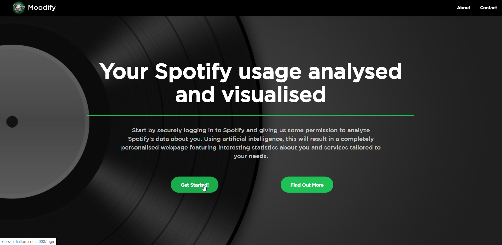

# High-Mood: Spotify mood analysis

This applicatation is used to analyze an individual's music listening patterns. By using listenig data obtained from Spotify's APIs, a profile is made of the user after which various techniques are applied to extract meaningful statistics. Using the analyzed data, further recommendations can be made to the user that extend beyond Spotify's current capabilities: The user is able to filter out specific types of suggestions based upon parameters such as general mood, excitedness and more.

This application was developed for the final 2nd year course "Project Software Engineering" at the University of Amsterdam (2019). This repository solely contains the documents that assisted us in our development efforts. For full code, see the high-mood organization's repositories.

## Example features/Screenshots

## Features
- Display happiness/excitedness of a user's song.
- Display song history
- Provide song predictions
- Customized song predictions based upon selected mood
- More analytics!

## Installation
See wiki

## Further development
- Optimize algorithm
- Better data aggregation leads to better result. Thus more training data is required
- Automatic Spotify playlist creation

## References
The initial machine learning model was trained using data from the paper
[_Studying emotion induced by music through a crowdsourcing game. Information Processing & Management_ (A. Aljanaki, F. Wiering, R. C. Veltkamp. , 2015.)](http://www2.projects.science.uu.nl/memotion/emotifydata/)

# License
GNU GPLv3
